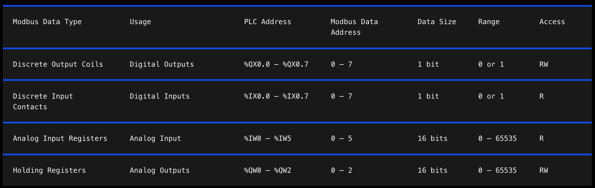
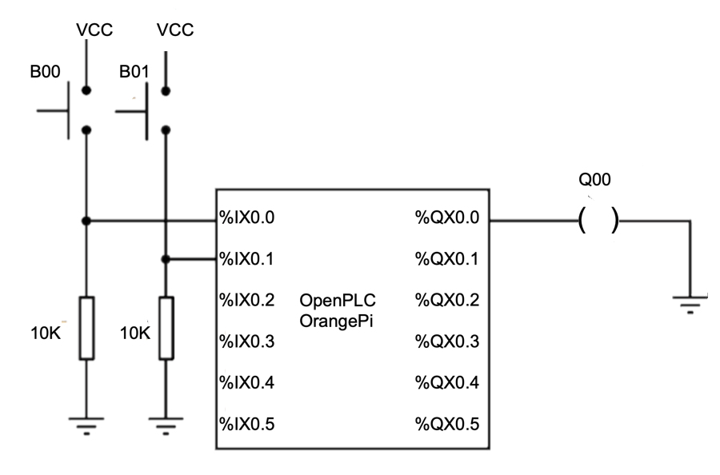
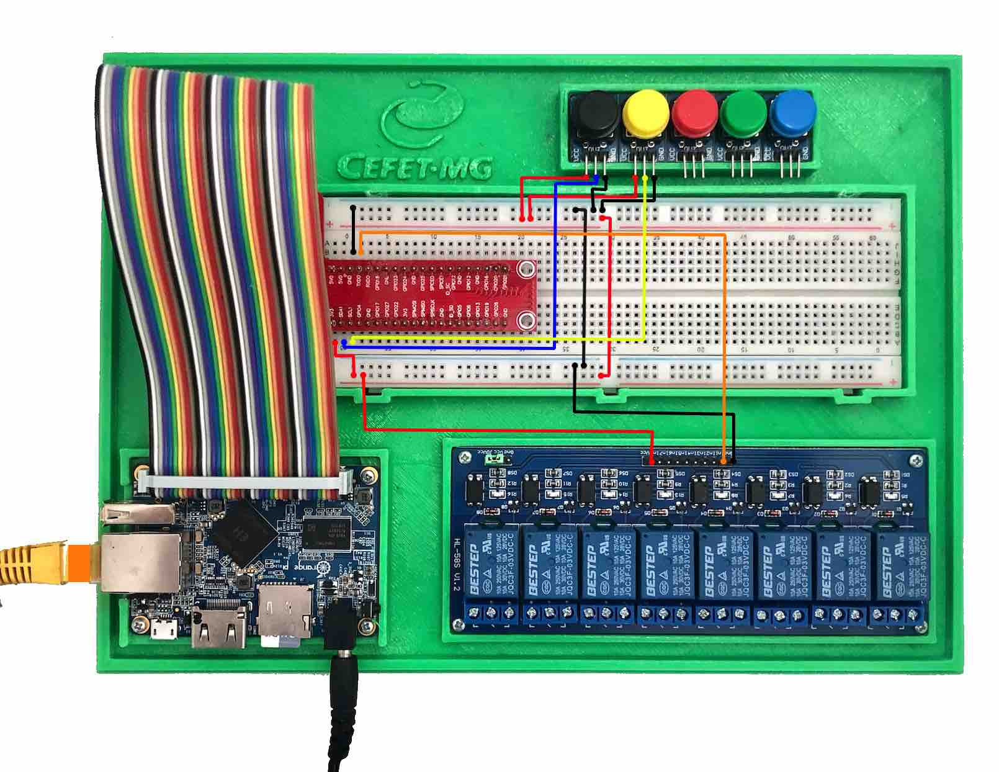
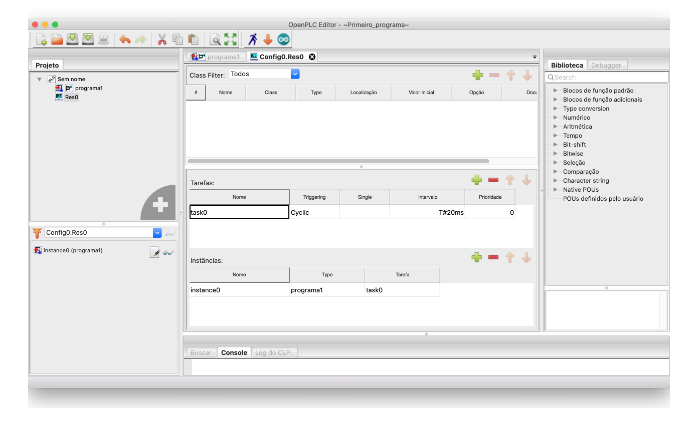
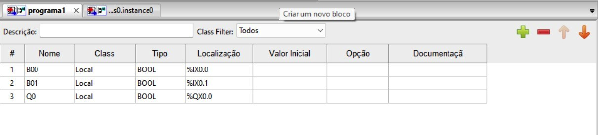
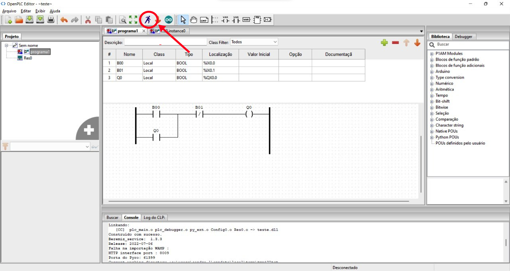
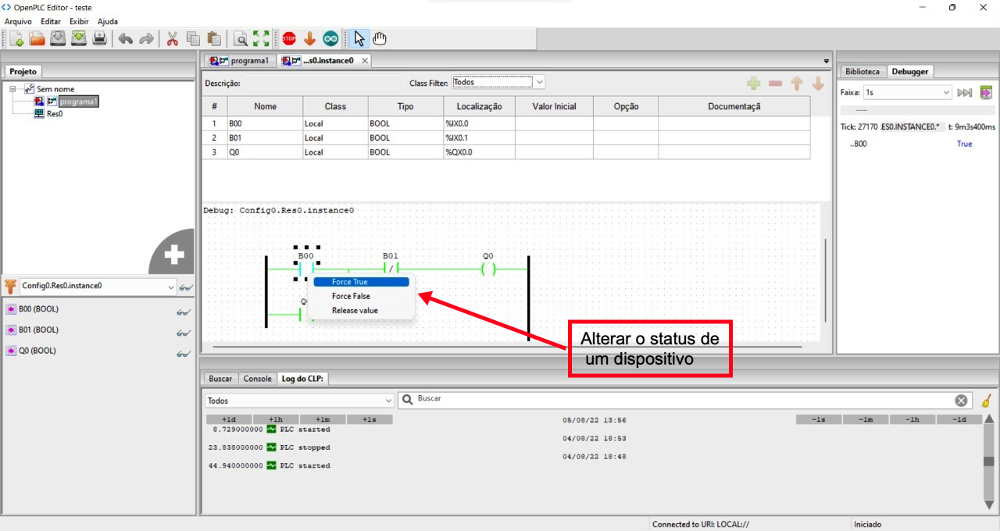
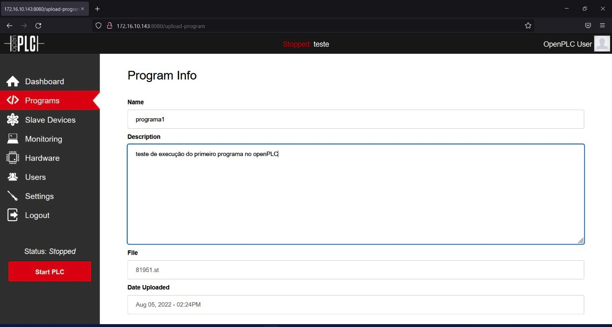
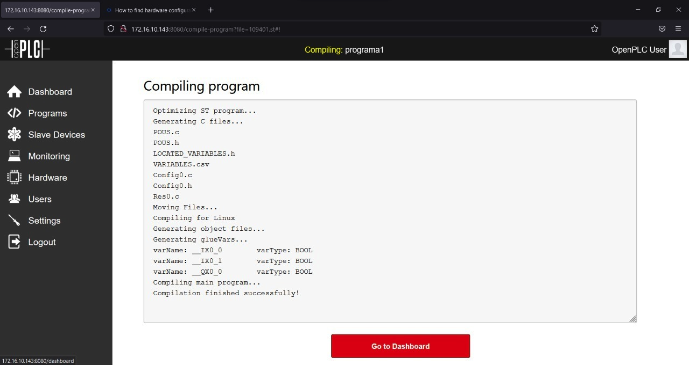

<td style="width: 20%;"></td>

<strong>OpenPLC</strong>

<strong>Prof Epaminondas Lage</strong>

<a href="http://lattes.cnpq.br/7787341723868111"> Currículo Lattes LAGE, E. S.</a> 

# Índice 
* [Introdução](#Introdução)
* [A IEC 6113](#A-IEC-6113)
* [OpenPLC](#OpenPLC)
* [OpenPLC Editor](#OpenPLC-Editor)
* [OpenPLC Runtime](#OpenPLC-Runtime)
* [Plataformas de Hardware para o OpenPLC](#Plataformas-de-Hardware-para-o-OpenPLC)
* [Endereçamento de Entrada, Saída e Memória](#Endereçamento-de-Entrada-Saída-e-Memória)
* [Endereçamento Físico](#Endereçamento-Físico)
* [Endereçamento Modbus](#Endereçamento-Modbus)
* [Dispositivos Escravos](#Dispositivos-Escravos)
* [Criando o primeiro projeto no OpenPLC Editor](#Criando-o-primeiro-projeto-no-OpenPLC-Editor)
* [Carregando programas para o OpenPLC Runtime](#Carregando-Programas-para-o-OpenPLC-Runtime)
* [Status do Projeto](#Status-do-Projeto)
* [Referências](#Referências)

# Introdução 

Um controlador monitora o estado real do processo de uma planta através de um número de transdutores, definido de acordo com a aplicação. Os transdutores convertem as grandezas físicas em sinais normalmente elétricos, os quais são conectados com as entradas dos controladores. Transdutores digitais (discretos) medem variáveis com estados distintos, tais como ligado/desligado ou alto/baixo, enquanto os transdutores analógicos medem variáveis com uma faixa contínua, tais como pressão, temperatura, vazão ou nível.

<table border="0">
<tbody>
<tr>
<td style="width: 50%;"></td>
</tr>
<tr>
<td style="text-align: center;">Figura 1 - Sistemas Industriais.</td>
</tr>
</tbody>
</table>

Com base nos estados das suas entradas (variáveis de processo - PV), o controlador utiliza um algoritmo de controle embutido para calcular os estados das suas saídas (variáveis manipuladas - MV). Os sinais elétricos das saídas são convertidos para o processo através dos atuadores. Muitos atuadores geram movimentos como válvulas, motores, bombas e outros e utilizam a energia potencial pneumática para o acionamento.

O operador interage com o controlador através dos parâmetros de controle (ex: Set Point, Kp, Ki, Kd). Alguns controladores podem mostrar os estados do processo através de um display ou tela, que é chamado de IHM (Interface Homem Máquina).

Atualmente, os Controladores Programáveis aplicam-se tanto ao controle discreto (I/O) quanto para o controle de malhas analógicas. Diferentes computadores são conectados via rede local (LAN), redes de longas distâncias (WAN) a um computador supervisório central, o qual gerencia os alarmes, receitas e relatórios.

## Motivação para Sistemas Abertos

Os PLC's são um dos componentes mais críticos da indústria atual. Com a utilização dos sistemas de controle na maioria das indústrias, incluindo aplicações que exigem segurança, é muito importante que os programas possam ser facilmente entendidos por uma grande parte dos profissionais do chão de fábrica. Além do programador, o programa de controle deve ser de fácil entendimento para todos os técnicos, engenheiros e gerentes de processo.

Por décadas o mercado tem sido dominado por poucos fabricantes que oferecem soluções muito parecidas, porém com particularidades nos dialetos de programação. Muitos usuários têm decidido eleger no mínimo três fornecedores, com o objetivo principal de minimizar o risco. Em aplicações reais, isto implica em um maior custo devido ao retrabalho e problemas de comunicação entre produtos de diferentes fabricantes.

# A IEC 6113
  
A International Electrotechnical Commission (Comissão Eletrotécnica Internacional), normalmente conhecida como IEC, é o organismo de normalização internacional não lucrativo independente líder mundial para as tecnologias elétrica, eletrónica e relacionadas. A IEC 61131 traz requisitos de hardware e software para sistemas que envolvam CLPs é dividida em cinco partes:
  
* Parte 1: IEC 61131-1 Informações gerais. Definição da informação geral, da terminologia básica e dos conceitos; Publicado em 1992 está na Versão 2.0 desde 2003.;
* Parte 2: IEC 61131-2 Requisitos de hardware . Exigências de equipamento e testes eletrônicos e testes mecânicos de construção e verificação; Publicado em 1992 encontra-se na Versão 4.0 desde 2017.;
* Parte 3: IEC 61131-3 Linguagens de programação. Estrutura do Software do CLP, execução do programa e linguagens de programação; Publicado em 1993 está na Versão 3.0 desde 2013.;
* Parte 4: IEC 61131-4 Guia de orientação ao usuário. Guia de orientação ao usuário na seleção, instalação e manutenção de CLP's. Publicado em 1995 está na Versão 2.0 from 2004.;
* Parte 5: IEC 61131-5 Comunicação.Facilidade do Software em especificação de mensagens de serviços a comunicar-se com outros dispositivos usando as comunicações baseadas em MAP (Manufacturing Messaging Services). Publicado em 1998 apresenta-se naVersão 1.0 desde 2000.;
* Parte 6: IEC 61131-6 Segurança Funcional.Comunicação via facilidade do Software fieldbus para comunicação de PLC s utilizando IEC fieldbus. Edição 1.0 - 2012.;
* Parte 7: IEC 61131-7 Programação de Controle Fuzzy  Programação utilizando Lógica Nebulosa (Fuzzy).Edição 1.0 - 2000;
* Parte 8: IEC 61131-8 Guia para implementação das linguagens: Diretrizes para aplicação e implementação de linguagens de programação. Edição 3.0 - 2017.
* Parte 9: IEC 61131-9: Interface de comunicação digital single-drop para pequenos sensores e atuadores (SDCI).Especifica uma tecnologia de interface de comunicação digital single-drop para pequenos sensores e atuadores SDCI.A edição atual é 1.0 de 2013.
* Parte 10: IEC 61131-10: PLC aberto XML Exchange Format.Este novo padrão IEC é baseado na especificação original PLCopen XML. Com o lançamento da 3ª edição da IEC 61131-3 em 2013, uma grande reformulação foi necessária para incluir as mudanças e extensões como recursos orientados a objetos. Lançado em abril de 2019.
  
## IEC 61131-3 – Linguagens de Programação
  
Foco de nosso objeto de trabalho, a norma IEC 61131 em sua parte 3, tem por objetivo:
  
Fornecer metodologias de construção de lógicas de programação de forma estruturada e modular, permitindo a quebra dos programas em partes gerenciáveis;
Definir 5 linguagens de programação, cada uma com suas características, de forma a cobrir a maioria das necessidades de controle atuais;
Permite o uso de outras linguagens de programação, desde que obedecidas as mesmas formas de chamadas e trocas de dados (Visual Basic, Flow Chart, C++, etc) e possui uma abordagem e estruturação top-down e bottom-up, fundamentada em 3 princípios:

* Modularização;
* Estruturação;
* Reutilização.

Dentro destes aspectos, a IEC 61131-3 define cinco linguagens de programação:

* ST (Structured Text) Texto Estruturado
* IL (Instruction List) Lista de Instruções
* LD (Ladder) Linguagem ladder
* FBD (Function Block Diagram) Diagrama de bloco
* SFC (Sequential Flow Chart) Diagrama de Fluxo

As duas primeiras linguagens acima (ST e IL) são ditas textuais por conterem instruções na forma de texto. As duas seguintes (LD e FBD) são ditas gráficas por possuírem representação na forma de símbolos. A linguagem SFC é normalmente tida como linguagem gráfica, porém também permite programações textuais.

É comum em alguns ambientes de programação que atendem à IEC 61131-3 como o CODESYS, a presença de uma sexta linguagem de programação, conhecida como CFC (do inglês Continuous Function Chart) que não faz parte das definições da norma. O software de programação  compatíveis IEC 61131-3 permite que os usuários criem programas em um ambiente padrão global compatível com IEC. Projetos podem ser criados com uma variedade de linguagens de programação em qualquer combinação.

* Ambiente de programação aberto e flexível com portabilidade de código.
* Versões Express (gratuita) e Pro (paga) disponíveis.
* Biblioteca de modelos de programação para aplicativos de processo comuns, reduzindo o tempo de lançamento no mercado
* A biblioteca de blocos de funções para dispositivos e instrumentos MKS permite "plug & play"

# OpenPLC 

O projeto do OpenPLC  é um ambiente de desenvolvimento de programas, é compatível com praticamente qualquer software SCADA existente, utiliza o protocolo Modbus/TCP para comunicação e inclui em seu Editor uma Interface de usuário intuitiva e fácil de de utilizar. Outro ponto interessante a se destacar condiz a compatibilidade do OpenPLC Editor, sendo esse um software que permite escrever programas para CLP de acordo com a IEC 61131-3, estando em conformidade com o PLCopen XML (https://beremiz.org/doc). 

O Projeto OpenPLC consiste em duas partes: Runtime e Editor. O Runtime é um software portátil projetado para rodar desde o menor de todos os microcontroladores (compatível com Arduino) até poderosos servidores nas nuvens. Ele é responsável por executar os programas PLC que você cria usando o Editor.

 A programação do hardware é realizada por meio do Editor, onde são gerados arquivos ST. O aplicativo OpenPLC possui um servidor Web baseado em NodeJs (https://nodejs.org/en/) que controla se o OpenPLC está de fato sendo executado ou não, e permite que o usuário faça upload do arquivo ST. Durante a execução do servidor, basta abrir o navegador, que haverá uma interface Web, possibilitando o envio de novos programas ao OpenPLC.
 
 ## Porque usar este software? 
  
Por ser uma ferramenta totalmente aberta, o OpenPLC possibilita que qualquer pessoa tenha acesso a todos os arquivos e informações relativas ao projeto, o que resulta em uma colaboração significativa para disseminação de conhecimentos voltados principalmente para aplicações industriais que utilizam CLPs. Se comparado a um CLP tradicional, o OpenPLC  apresenta componentes relativamente baratos, o que abre muitas portas dentro do cenário de automação.

# OpenPLC Editor

O OpenPLC Editor, projeto criado por Thiago Rodrigues Alves (estudante de doutorado na Universidade do Alabama), surgiu através do objetivo de encontrar vulnerabilidade em PLCs (Programmable Logic Controller ou Controlador Lógico Programável - CLP). Entretanto, dificilmente algum fabricante de CLP disponibilizaria seu código fonte para que o estudante pudesse realizar uma análise mais profunda, a fim de validar seus estudos. Devido a isto, ele resolveu criar o seu próprio CLP de hardware e software livres, que pode ser programado nas 5 principais linguagens definidas conforme a norma IEC 61131-3 (https://pt.wikipedia.org/wiki/IEC_61131-3), que estabelece a arquitetura básica de software e as linguagens de programação para CLPs. As linguagens suportadas pelo OpenPLC Editor estão apresentadas na figura 2.

<table border="0">
<tbody>
<tr>
<td style="width: 50%;"></td>
</tr>
<tr>
<td style="text-align: center;">Figura XXX - Linguagens de programação disponibilizadas no OpenPLC Editor.</td>
</tr>
</tbody>
</table>

* Diagrama Ladder (LD), Gráfica.
* Diagrama de Blocos (FBD), Gráfica.
* Texto Estruturado (ST), textual.
* Lista de Instruções (IL), textual.
* Diagrama de Funções Sequenciais (SFC).
  
A figura 3 ilustra a linguagem Ladder sendo aplicada sobre o OpenPLC Editor. 

<table border="0">
<tbody>
<tr>
<td style="width: 50%;"></td>
</tr>
<tr>
<td style="text-align: center;">Figura XXX - Linguagem Ladder sendo aplicada sobre o OpenPLC Editor.</td>
</tr>
</tbody>
</table>

Em resumo, o Editor OpenPLC é um editor PLC compatível com IEC 61131-3 totalmente gratuito e de código aberto. Você pode usá-lo para fazer upload de código PLC diretamente para qualquer placa ou sistema executando OpenPLC Runtime.

# OpenPLC Runtime

O OpenPLC Runtime permite executar programas PLC criados no Editor OpenPLC. Esta runtime, instalada em um SBC possui um servidor web integrado que permite configurar vários parâmetros da runtime. Microimplementações do OpenPLC Runtime (ou seja, versões da runtime que vão em microcontroladores e placas Arduino) não possuem o servidor web embutido. Em vez disso, todas as configurações de tempo de execução para o micro runtime são feitas diretamente da caixa de diálogo de upload do OpenPLC Editor.

O servidor web runtime n SBC está disponível em seu endereço IP de destino na porta 8080. Por exemplo, se você instalou o OpenPLC Runtime em OrangePi One e seu endereço IP é 172.16.10.143, então você pode acessar o OpenPLC Runtime abrindo seu navegador web e apontando para http://172.16.10.143:8080.

Se você estiver recebendo erros de página, certifique-se de que seu computador possa acessar o OrengePi One em sua rede. Se você não sabe o endereço IP da sua placa, utilize uma ferramenta pas escanear sua rede e descobrir o IP dele.

Depois de acessar o servidor web OpenPLC, você deverá ver na janela do seu navegador uma página de login como a apresentada na figura XXXX.

<table border="0">
<tbody>
<tr>
<td style="width: 50%;"></td>
</tr>
<tr>
<td style="text-align: center;">Figura XXX - Tela inicial da Runtime do OpenPLC Editor.</td>
</tr>
</tbody>
</table>

O nome de usuário e senha padrão é openplc (login) e openplc (senha). Isso significa que a primeira coisa que você deve fazer após o login pela primeira vez é alterar o nome de usuário e a senha padrão! É muito fácil fazer isso. Basta ir ao menu Users à esquerda e clicar no OpenPLC User para alterar as informações do usuário como desejar.
  
  * Endereço IP do OrangePi que contém a runtime
  * http://172.16.10.143:8080
  * user=openplc
  * passwd=openplc

## Habilitando o acesso de E/S de hardware

Por padrão, o tempo de execução do OpenPLC é instalado com um driver em branco. Isso significa que ele não poderá controlar seus pinos GPIO de hardware imediatamente com o OpenPLC. Primeiro, você terá que habilitar o driver de hardware correto para sua plataforma. No menu à esquerda, clique em “Hardware” e escolha o driver apropriado no menu pop-up. Certifique-se de escolher o driver correto para sua placa, caso contrário, o OpenPLC Runtime falhará ao compilar o núcleo de tempo de execução.

<table border="0">
<tbody>
<tr>
<td style="width: 50%;"></td>
</tr>
<tr>
<td style="text-align: center;">Figura XXX - Escolha do hardware que está instalado o OpenPLC Runtime.</td>
</tr>
</tbody>
</table>

# Plataformas de Hardware para o OpenPLC

O OpenPLC run time é compativel com algumas plataformas livres, como Arduino, Raspberry Pi e ESP8266. É oficialmente suportada nas seguintes plataformas:
  
* Arduino Uno / Nano / Leonardo / Micro
* Arduino Mega / Due
* Arduino Nano Every / IoT / BLE
* Arduino RB2040 Connect
* Arduino Mkr / Zero / WiFi
* Arduino Pro (Machine Control and EDGE)
* Controllino Maxi / Automation / Mega / Mini
* Productivity Open P1AM
* ESP8266 (nodemcu)
* ESP32
* Raspberry Pi 2 / 3 / 4
* PiXtend
* UniPi Industrial Platform
* Neuron PLC
* FreeWave Zumlink
* FreeWave ZumIQ
* Windows (generic target as a soft-PLC)
* Linux (generic target as a soft-PLC)

# Endereçamento de Entrada, Saída e Memória

As aplicações PLC interagem com o mundo externo através de módulos de entrada e saída e/ou protocolos de comunicação SCADA. Ao projetar suas aplicações de CLP, você decide quais variáveis devem ser conectadas aos módulos de E/S e comunicação, rotulando a variável com um endereço de CLP.

O OpenPLC Runtime usa a nomenclatura IEC 61131-3 para endereçar as localizações de entrada, saída e memória. O endereçamento das localizações de E/S é feito através do uso de sequências de caracteres especiais. Essas sequências são uma concatenação do sinal de porcentagem “%”, um prefixo de localização, um prefixo de tamanho e um ou mais números naturais separados por espaços em branco. Os seguintes prefixos de local são suportados:

   * I para entrada
   * O para saída
   * M para memória

Os seguintes prefixos de tamanho são suportados:

   * X para bit (1 bit)
   * B para byte (8 bits)
   * W para palavra (16 bits)
   * D para palavra dupla (32 bits)
   * L para palavra longa (64 bits)

Por exemplo, se você deseja ler o estado da primeira entrada digital em uma variável BOOL, deve declarar sua variável localizada em: %IX0.0. Se você quiser escrever o conteúdo de uma variável UINT na segunda saída analógica, você deve declarar sua variável UINT localizada em %QW2.

Nota: O mapeamento de PLC para E/S física depende da plataforma. Para mais informações sobre mapeamento de E/S do CLP para cada plataforma suportada.

Como você deve ter notado, os endereços PLC bit (X) possuem um endereço hierárquico de duas partes. A parte menos significativa (mais à direita) pode ser interpretada como uma posição em um byte e deve estar no intervalo de 0 a 7. A parte mais significativa (mais à esquerda) não deve ser maior que 1023. As partes são separadas por um único período. Tamanhos de dados diferentes de X têm um endereço hierárquico de uma parte. Eles não devem conter um ponto (.) e não devem ser maiores que o endereço máximo de localização de memória para sua plataforma.

Os seguintes são exemplos inválidos de endereços PLC no OpenPLC pelo motivo declarado:

   * %IX0.8 O índice menos significativo é maior que 7.
   * %QX0.0.1 A hierarquia de três partes não é um endereço permitido.
   * %IB1.1 Hierarquia de duas partes só é permitida para tamanho de dados X

# Endereçamento Físico

O OpenPLC Runtime é compatível com várias plataformas de hardware diferentes com diferentes configurações de módulos de E/S. Internamente, todas as variáveis de E/S estão associadas a um Endereço do PLC, conforme explicado em Endereçamento de Entradas, Saídas e Memória. A camada de hardware é o componente responsável por traduzir as variáveis de endereço interno do PLC em localizações físicas do hardware. Cada plataforma suportada pelo OpenPLC deve ter uma camada de hardware diferente. Abaixo você encontra a descrição da pinagem de cada plataforma, extraída do arquivo da camada de hardware da plataforma.

https://github.com/orangepi-xunlong/wiringOP

OrangePi One/Lite/Pc/Plus/PcPlus/Plus2e

   +------+-----+----------+------+---+OrangePiH3+---+------+----------+-----+------+
  | GPIO | wPi |   Name   | Mode | V | Physical | V | Mode | Name     | wPi | GPIO |
   +------+-----+----------+------+---+----++----+---+------+----------+-----+------+
  |      |     |     3.3V |      |   |  1 || 2  |   |      | 5V       |     |      |
  |   12 |   0 |    SDA.0 |  OUT | 0 |  3 || 4  |   |      | 5V       |     |      |
  |   11 |   1 |    SCL.0 |  OUT | 0 |  5 || 6  |   |      | GND      |     |      |
  |    6 |   2 |      PA6 |  OUT | 0 |  7 || 8  | 0 | OUT  | TXD.3    | 3   | 13   |
  |      |     |      GND |      |   |  9 || 10 | 0 | OUT  | RXD.3    | 4   | 14   |
  |    1 |   5 |    RXD.2 |  OUT | 0 | 11 || 12 | 0 | OUT  | PD14     | 6   | 110  |
  |    0 |   7 |    TXD.2 |  OUT | 0 | 13 || 14 |   |      | GND      |     |      |
  |    3 |   8 |    CTS.2 |  OUT | 0 | 15 || 16 | 0 | OUT  | PC04     | 9   | 68   |
  |      |     |     3.3V |      |   | 17 || 18 | 0 | OUT  | PC07     | 10  | 71   |
  |   64 |  11 |   MOSI.0 |  OUT | 0 | 19 || 20 |   |      | GND      |     |      |
  |   65 |  12 |   MISO.0 |  OUT | 0 | 21 || 22 | 0 | OUT  | RTS.2    | 13  | 2    |
  |   66 |  14 |   SCLK.0 |  OUT | 0 | 23 || 24 | 0 | OUT  | CE.0     | 15  | 67   |
  |      |     |      GND |      |   | 25 || 26 | 0 | OUT  | PA21     | 16  | 21   |
  |   19 |  17 |    SDA.1 |  OUT | 0 | 27 || 28 | 0 | OUT  | SCL.1    | 18  | 18   |
  |    7 |  19 |     PA07 |  OUT | 0 | 29 || 30 |   |      | GND      |     |      |
  |    8 |  20 |     PA08 |  OUT | 0 | 31 || 32 | 0 | OUT  | RTS.1    | 21  | 200  |
  |    9 |  22 |     PA09 |  OUT | 0 | 33 || 34 |   |      | GND      |     |      |
  |   10 |  23 |     PA10 |  OUT | 0 | 35 || 36 | 0 | OUT  | CTS.1    | 24  | 201  |
  |   20 |  25 |     PA20 |  OUT | 0 | 37 || 38 | 0 | OUT  | TXD.1    | 26  | 198  |
  |      |     |      GND |      |   | 39 || 40 | 0 | OUT  | RXD.1    | 27  | 199  |
  +------+-----+----------+------+---+----++----+---+------+----------+-----+------+
  | GPIO | wPi |   Name   | Mode | V | Physical | V | Mode | Name     | wPi | GPIO |
  +------+-----+----------+------+---+OrangePiH3+---+------+----------+-----+------+

## Placas baseadas em microcontroladores

<table border="0">
<tbody>
<tr>
<td style="width: 50%;"></td>
</tr>
<tr>
<td style="text-align: center;">Figura XXX - Endereçamento físico para Arduino Mega e Due.</td>
</tr>
</tbody>
</table>

<table border="0">
<tbody>
<tr>
<td style="width: 50%;"></td>
</tr>
<tr>
<td style="text-align: center;">Figura XXX - Endereçamento físico para Arduino Uno, Leonard, Nano, Micro e Zero.</td>
</tr>
</tbody>
</table>

<table border="0">
<tbody>
<tr>
<td style="width: 50%;"></td>
</tr>
<tr>
<td style="text-align: center;">Figura XXX - Endereçamento físico para ESP32.</td>
</tr>
</tbody>
</table>

<table border="0">
<tbody>
<tr>
<td style="width: 50%;"></td>
</tr>
<tr>
<td style="text-align: center;">Figura XXX - Endereçamento físico para ESP8266.</td>
</tr>
</tbody>
</table>

<table border="0">
<tbody>
<tr>
<td style="width: 50%;"></td>
</tr>
<tr>
<td style="text-align: center;">Figura XXX - Endereçamento físico para Raspberry Pi.</td>
</tr>
</tbody>
</table>

# Endereçamento Modbus

O OpenPLC pode ser configurado como escravo Modbus (servidor). Um escravo Modbus é normalmente controlado por um mestre que realiza medição e controle. O mestre remoto inicia requisições de leitura e escrita para o escravo OpenPLC enviando quadros Modbus pela rede (Modbus/TCP). O micro runtime OpenPLC para placas compatíveis com Arduino também suporta quadros Modbus via serial e USB. O OpenPLC Runtime para hosts Linux e Windows possui um servidor Modbus rodando por padrão na porta TCP 502. Esta configuração pode ser alterada na aba “Settings”.

## OpenPLC suporta os seguintes códigos de função Modbus:

* Ler bobina de saída discreta (0x01)
* Bobina de saída discreta de gravação (0x05)
* Escreva várias bobinas de saída discreta (0x0F)
* Ler contatos de entrada discreta (0x02)
* Ler registros de entrada analógica (0x04)
* Ler registros de retenção de saída analógica (0x03)
* Gravar registro de retenção de saída analógica (0x06)
* Grava vários registros de saída analógica (0x10)

Os endereços Modbus vinculam-se a endereços PLC com base no valor do endereço hierárquico, ou seja, endereços PLC inferiores são mapeados para endereços Modbus inferiores. Os endereços são mapeados sequencialmente sempre que possível. A tabela a seguir mostra o espaço de endereço Modbus para o tempo de execução OpenPLC Linux/Windows:

<table border="0">
<tbody>
<tr>
<td style="width: 50%;"></td>
</tr>
<tr>
<td style="text-align: center;">Figura XXX - Endereçamento Modbus para Openplc em Windows e Linux.</td>
</tr>
</tbody>
</table>

Devido a limitações de memória, plataformas embarcadas como placas Arduino possuem um espaço de endereçamento Modbus muito mais limitado, conforme tabela abaixo:

<table border="0">
<tbody>
<tr>
<td style="width: 50%;"></td>
</tr>
<tr>
<td style="text-align: center;">Figura XXX - Endereçamento Modbus para Openplc para Arduino.</td>
</tr>
</tbody>
</table>

Plataformas baseadas em ATmega 328P, ATmega 168, ATmega32U4 e ATmega16U4 como o Arduino Uno e similares têm um espaço de endereçamento ainda mais limitado devido à sua disponibilidade de memória RAM ser muito baixa:

<table border="0">
<tbody>
<tr>
<td style="width: 50%;"></td>
</tr>
<tr>
<td style="text-align: center;">Figura XXX - Endereçamento Modbus para Openplc para Arduino Nuno, ATmega 328P, ATmega 168 entre outros.</td>
</tr>
</tbody>
</table>

Bobinas de saída discreta e ligação de contatos de entrada discretos são baseadas no endereço PLC de duas partes, sem endereços de dados Modbus não utilizados. A parte menos significativa do endereço do PLC tem um intervalo de 0 a 7, portanto, é necessário um pouco de matemática para traduzir entre os endereços do PLC e os endereços de dados Modbus. Dado o endereço de dados Modbus, o endereço do PLC é determinado desta forma:

    msp := int(modbus_data_address / 8)
    lsp := modbus_data_address mod 8
    final address = msp.lsp

Por exemplo, se o endereço Modbus para uma bobina de saída discreta for 22, a parte mais significativa será 2 (22/8) e a parte menos significativa será 6 (22 mod 8). Portanto, o endereço do PLC é %QX2.6.

# Dispositivos Escravos

https://openplcproject.com/docs/2-6-slave-devices/

# Criando o primeiro projeto no OpenPLC Editor
  
Este primeiro projeto é um simples de  botão liga e botão desliga que aciona uma saída de relé. Você vai precisar de:

    * Um microcontrolador com o OpenPLC Runtime instalado, no nosso caso o OrangePi One.
    * Um microcomputador com o OpenPLC Editor instalado e acesso a rede local.
    * Dois botões de pressão
    * Um Rele
    * Um Protoboard
    * Uma conexão de rede ethernet com conector RJ45 no microcontrolador
    * Jumpers 
    
Para começar, conecte seu circuito assim:

<table border="0">
<tbody>
<tr>
<td style="width: 50%;"></td>
</tr>
<tr>
<td style="text-align: center;">Figura XXX - dsdsdsdsdsdsdjkhsigdigdiuegdiugd.</td>
</tr>
</tbody>
</table>

Para a montagem deste circuito no Kit SBC Linux faça a montagem da figura XXXX.

<table border="0">
<tbody>
<tr>
<td style="width: 50%;"></td>
</tr>
<tr>
<td style="text-align: center;">Figura XXXX - Montagem do  primeiro circuito no Kit SBC Linux.</td>
</tr>
</tbody>
</table>

Observações Importantes:

* Vcc é o nível de tensão positivo para o seu dispositivo. Por exemplo, para OrangePi one é +3,3V.
* B00 e B01 são botões de pressão R1 e R2 são resistores pull-down já disponíveis no módulo de Botões.
* Nas placas Raspberry Pi, as duas primeiras entradas (%IX0.0 e %IX0.1) são invertidas no hardware. Isso pode causar problemas, pois será como se os botões fossem pressionados constantemente. Você pode inverter a entrada em seu programa PLC usando contatos negados (se você souber como fazê-lo) ou você pode simplesmente usar outras entradas, como %IX0.2 e %IX0.3.

Comece criando um novo projeto no Editor OpenPLC. Para isso basta clicar em Arquivo -> Novo. A caixa de diálogo  aparecerá para permitir que você escolha onde deseja armazenar seu projeto. Os projetos do Editor OpenPLC são na verdade pastas em vez de um único arquivo. Você não pode armazenar um projeto em uma pasta que já contenha arquivos. Crie uma nova pasta para o seu projeto, abra-a e escolha-a como local do seu projeto.

Depois de selecionar sua localização, o OpenPLC Editor criará o projeto para você com as configurações e configurações padrão e abrirá uma nova caixa de diálogo solicitando que você crie uma nova POU. POU significa Unidade de Organização do Programa e é usado para armazenar todo o código que você escreve em seu projeto. Existem três tipos de POUs que você pode criar:

    Programa – código de aplicação que combina entradas, saídas, funções e blocos de função
    Função – código de usuário reutilizável que tem um valor de retorno.
    Bloco de Função – código de usuário reutilizável que pode reter seu estado (instância)

<table border="0">
<tbody>
<tr>
<td style="width: 50%;"></td>
</tr>
<tr>
<td style="text-align: center;">Figura XXX - dsdsdsdsdsdsdjkhsigdigdiuegdiugd.</td>
</tr>
</tbody>
</table>

Para o propósito deste tutorial, estamos criando apenas uma POU de Programa. Portanto, basta preencher o nome do seu programa, certifique-se de que o Tipo de POU seja “programa” e que o Idioma seja “LD”. Além disso, lembre-se de que o nome do programa não pode conter espaços ou caracteres especiais.

<table border="0">
<tbody>
<tr>
<td style="width: 50%;"></td>
</tr>
<tr>
<td style="text-align: center;">Figura XXX - dsdsdsdsdsdsdjkhsigdigdiuegdiugd.</td>
</tr>
</tbody>
</table>
  
Quando você cria um novo programa, o OpenPLC Editor cria automaticamente uma configuração, um recurso, uma tarefa e uma instância para você. Esses itens dizem ao OpenPLC o que fazer com seu programa (ou seja, quando chamar uma função, como operar ciclicamente, etc). Você pode editar esses itens clicando duas vezes em Res0 no painel esquerdo.
  
<table border="0">
<tbody>
<tr>
<td style="width: 50%;"></td>
</tr>
<tr>
<td style="text-align: center;">Figura XXX - dsdsdsdsdsdsdjkhsigdigdiuegdiugd.</td>
</tr>
</tbody>
</table>
  
A janela principal exibirá um campo de entrada de variável global na parte superior (que permite criar variáveis globais para seu programa), uma janela de Tarefas e uma janela de Instâncias. Você pode criar novas tarefas clicando no sinal de mais verde dentro da janela Tarefas. Não estamos criando novas tarefas para este projeto. No entanto, você pode querer alterar o Intervalo para sua tarefa dependendo do hardware no qual você está executando o OpenPLC.

Os programas do CLP são cíclicos, o que significa que eles iniciam na primeira instrução, terminam na última instrução, esperam um pouco e depois fazem tudo de novo da primeira à última instrução. O intervalo de tarefas significa com que frequência seu ciclo de programa será chamado. O padrão é 20ms, o que significa que seu programa será executado uma vez a cada 20ms. Se você precisar que seu programa seja executado com mais frequência, poderá ajustar o tempo conforme desejar. No entanto, lembre-se de que, se você escolher um tempo cíclico muito baixo (como 1 ms), seu programa pode consumir 100% da CPU do seu dispositivo e ainda assim o dispositivo pode não conseguir executar seu programa corretamente. Um número seguro para todas as plataformas é geralmente 20ms.

Plataformas que possuem um sistema operacional como Windows e Linux são menos responsivos e podem não se comportar bem com tempos de ciclo mais baixos. Isso porque o Sistema Operacional pode interferir no escalonamento do ciclo do PLC dependendo das prioridades do kernel do SO. Plataformas simples como as placas Arduino, por outro lado, são realmente boas para manter um tempo de ciclo preciso e são mais suscetíveis a tempos de ciclo mais baixos.
  
<table border="0">
<tbody>
<tr>
<td style="width: 50%;"></td>
</tr>
<tr>
<td style="text-align: center;">Figura XXX - dsdsdsdsdsdsdjkhsigdigdiuegdiugd.</td>
</tr>
</tbody>
</table>
  
Agora que seu projeto foi finalmente criado, você pode começar a desenhar o diagrama lógico ladder. Clique no nome do seu programa no painel esquerdo para abrir o editor de lógica ladder. A parte superior da tela é reservada para suas variáveis. A parte central é usada para o seu diagrama. Então, vamos começar adicionando algumas variáveis. Clique no sinal de mais verde e adicione três variáveis:

<table border="0">
<tbody>
<tr>
<td style="width: 50%;"></td>
</tr>
<tr>
<td style="text-align: center;">Figura XXX - dsdsdsdsdsdsdjkhsigdigdiuegdiugd.</td>
</tr>
</tbody>
</table>

  O que queremos alcançar com este programa é que sempre que B00 for pressionado, a saída 00 será acionada e permanecerá até que B01 seja pressionado. Isso é alcançado por um circuito simples de trava de lógica ladder como este:
  
<table border="0">
<tbody>
<tr>
<td style="width: 50%;"></td>
</tr>
<tr>
<td style="text-align: center;">Figura XXX - dsdsdsdsdsdsdjkhsigdigdiuegdiugd.</td>
</tr>
</tbody>
</table>
  
  Para criar este circuito no editor, comece adicionando um barramento de alimentação esquerdo clicando no ícone do barramento de alimentação na barra de ferramentas.
  
<table border="0">
<tbody>
<tr>
<td style="width: 50%;"></td>
</tr>
<tr>
<td style="text-align: center;">Figura XXX - dsdsdsdsdsdsdjkhsigdigdiuegdiugd.</td>
</tr>
</tbody>
</table>
  
Ajuste a contagem de pinos do trilho de alimentação esquerdo. Adicione outro barramento de alimentação, mas desta vez selecione “trilho de alimentação direito” nas propriedades. Coloque-o no lado direito da tela. Isso é suficiente para você configurar os degraus do seu Diagrama Ladder.

Agora você pode começar a adicionar seus elementos de escada. Adicione um contato clicando no botão de contato na barra de ferramentas ou clicando com o botão direito do mouse na janela do editor em branco e selecionando Adicionar->Contato. Na janela que aparece, no parâmetro “Variável”, selecione B0 para associar seu novo contato à variável B00.
Repita o processo para adicionar mais dois contatos, um associado ao B01 e outro associado ao Q0. Para o contato Q0, selecione Negado como modificador. Finalmente, adicione uma bobina clicando no botão bobina na barra de ferramentas ou clicando com o botão direito do mouse na janela do editor em branco e selecionando Adicionar-> bobina. Associe sua nova bobina à variável Q0 e adicione um barramento de alimentação direito para fechar o circuito. Posicione os componentes no lugar para que eles se pareçam com esta imagem:  

<table border="0">
<tbody>
<tr>
<td style="width: 50%;"></td>
</tr>
<tr>
<td style="text-align: center;">Figura XXX - dsdsdsdsdsdsdjkhsigdigdiuegdiugd.</td>
</tr>
</tbody>
</table>
  
O passo final é conectar todos os componentes arrastando suas extremidades para formar uma linha. Conecte o lado esquerdo dos contatos B0 e Q0 ao barramento de alimentação esquerdo. Conecte o lado direito do B00 com o B01, o lado direito do B01 com a bobina Q0 e o lado direito da bobina Q0 com o barramento de alimentação direito. Desenhe o circuito de contato Q0 paralelo conectando o lado direito do contato Q0 com o lado esquerdo do B01. Seu projeto final deve se parecer com a figura 10 neste tutorial.

Este circuito inicialmente tem a Q0 desligada. Quando você pressiona B00 mesmo que por um pequeno instante, o circuito aciona a Q0 (dado que B01 também não é pressionado). Uma vez que a Q0 liga, ela ignora o botão B01 no circuito para se ligar continuamente mesmo após liberar B00. Este é um bom truque na lógica ladder, você pode realmente usar as saídas como contatos! Agora, a única maneira de desligar a Q0 é pressionando B01. Como o B01 é um contato negado, ele abrirá o circuito assim que for pressionado, desligando a Q0.

Agora que seu projeto foi criado, é um bom momento para testá-lo antes de carregá-lo no OpenPLC Runtime. Você pode simular o comportamento do seu programa clicando em Start PLC Simulation na barra de ferramentas.

<table border="0">
<tbody>
<tr>
<td style="width: 50%;"></td>
</tr>
<tr>
<td style="text-align: center;">Figura XXX - dsdsdsdsdsdsdjkhsigdigdiuegdiugd.</td>
</tr>
</tbody>
</table>

Quando você clica nesse botão, seu projeto é compilado usando um processo semelhante ao OpenPLC Runtime. Se houver algum erro em seu programa, a compilação falhará e você será alertado sobre os erros no painel Console na parte inferior da tela. Se a compilação for bem-sucedida, o OpenPLC Editor começará a executar seu código. Para visualizar seu código rodando interativamente, clique em Debug instance no painel esquerdo:

<table border="0">
<tbody>
<tr>
<td style="width: 50%;"></td>
</tr>
<tr>
<td style="text-align: center;">Figura XXX - linhas verdes e pretas.</td>
</tr>
</tbody>
</table>

Isso abrirá uma nova janela onde você poderá ver o fluxo elétrico do seu programa. As linhas em verde são ativadas, onde as linhas em preto não são. Você pode forçar um contato ou bobina a ser ativado ou desativado clicando com o botão direito nele e selecionando Forçar Verdadeiro ou Forçar Falso. Tente forçar B01 a ser verdadeiro e observe o caminho do fluxo para a bobina Q0. Em seguida, force B01 de volta para falso e verifique se Q0 ainda está ativado devido ao circuito de trava.

Além de visualizar graficamente o fluxo elétrico no diagrama, você também pode acompanhar os dados em cada variável do seu programa no painel Debugger no lado direito da tela. Você pode adicionar variáveis no painel Debugger clicando no ícone de óculos na frente de cada variável do painel à esquerda. Além disso, clicando duas vezes em uma variável no painel Debugger, você pode ver um gráfico em tempo real mostrando os valores atuais da variável. Isso pode ser muito útil quando seu programa está contando etapas ou manipulando dados.

<table border="0">
<tbody>
<tr>
<td style="width: 50%;"></td>
</tr>
<tr>
<td style="text-align: center;">Figura XXX - Simulação do programa em execução.</td>
</tr>
</tbody>
</table>
  
Finalmente, depois de ter criado e testado o programa, o último passo é gerar seu programa em um formato que o OpenPLC Runtime entenda. Para isso, basta clicar em Generate program for OpenPLC Runtime na barra de ferramentas e salvar o arquivo .st em seu computador. Este arquivo é seu programa de lógica ladder escrito em uma linguagem que o OpenPLC Runtime pode entender. Você pode carregar este arquivo posteriormente para o OpenPLC Runtime conforme explicado em no tutorial Carregando Programas para o OpenPLC Runtime. 
  
# Carregando Programas para o OpenPLC Runtime.   
 
A runtime do OpenPLC possui um servidor web integrado que permite configurar o OpenPLC e também fazer upload de novos programas para que ele seja executado. Microimplementações do OpenPLC Runtime (ou seja, versões do runtime que vão em microcontroladores e placas Arduino) não possuem o servidor web embutido. Em vez disso, todas as configurações de runtime para o micro runtime são feitas diretamente da caixa de diálogo de upload do OpenPLC Editor (veja Instalando o OpenPLC Runtime em Placas Microcontroladoras).

O servidor Web OpenPLC pode ser acessado abrindo um navegador da Web em seu computador e digitando o endereço IP do seu dispositivo OpenPLC na porta 8080.

Após efetuar login no servidor web, você verá o painel do OpenPLC com algumas informações sobre o programa em execução atual e os logs de tempo de execução.

  http://ip_do_orangePi:8080
  User:openplc
  Paswwd:openplc
  
Para carregar seu novo programa, vá para a seção Programas no menu à esquerda. Lá você deve ver uma lista de todos os seus programas enviados recentemente. Você pode reverter para um programa carregado anteriormente apenas clicando nele na lista e confirmando na próxima página. Para fazer o upload de um novo programa, clique em “Choose File”, selecione seu arquivo .st e clique em “Upload Program”.

<table border="0">
<tbody>
<tr>
<td style="width: 50%;"></td>
</tr>
<tr>
<td style="text-align: center;">Figura XXX - Fazer carga de programa no OpenPLC Runtime.</td>
</tr>
</tbody>
</table>

<table border="0">
<tbody>
<tr>
<td style="width: 50%;"></td>
</tr>
<tr>
<td style="text-align: center;">Figura XXX - Fazer carga de programa no OpenPLC Runtime.</td>
</tr>
</tbody>
</table>

Na janela que aparece, basta preencher algumas informações sobre o seu programa para que você saiba do que se trata na próxima vez que tentar carregá-lo novamente. Quando terminar, clique em “Upload program” para finalmente carregar seu novo arquivo .st no OpenPLC.

<table border="0">
<tbody>
<tr>
<td style="width: 50%;"></td>
</tr>
<tr>
<td style="text-align: center;">Figura XXX - Escolha do programa a ser carregado na Runtime do OpenPLC.</td>
</tr>
</tbody>
</table>

Assim que o arquivo for carregado, você será direcionado de volta à tela do painel e o status do OpenPLC mudará para “compilando”. Os logs sobre o processo de compilação são exibidos na caixa de logs de tempo de execução. Quando o processo de compilação estiver concluído, o status mudará para “executando” e seu novo programa será executado. Se houver um erro em seu programa, o status mudará para “parado” e os erros serão exibidos na caixa de logs de tempo de execução.

<table border="0">
<tbody>
<tr>
<td style="width: 50%;"></td>
</tr>
<tr>
<td style="text-align: center;">Figura XXX - Compilação do programa .sd para ser executado no hardware selecionado.</td>
</tr>
</tbody>
</table>

  

  
 

# Referências

* FREITAS, C. M. Conheça o OpenPLC - O primeiro CLP de Código Aberto Padronizado Disponível em:https://www.embarcados.com.br/openplc-o-primeiro-clp-de-codigo-aberto/ Acesso em Março de 2019.

* ALVES, T.R. What is OpenPLC?. OpenPLC Project, 2017. Disponível em: http://www.openplcproject.com/. Acesso em novembro de 2017.

* ALVES, T.R.; BURATTO, M.; SOUZA, F.M.; RODRIGUES, T, V. OpenPLC: An Open Source Alternative to Automation. In IEEE 2014 Global Humanitarian Technology Conference (GHTC 2014), San Jose, CA, 2014, pp. 585-589.

* JOHN, K.H.; TIEGELKAMP, M. IEC 61131-3: Programming Industrial Automation Systems,” 2nd ed. Springer, 2010 pp.147-168.
  
* https://crushtymks.com/pt/industrial-automation/1102-goals-and-benefits-of-the-iec-61131-standard-plcs-8211-programmable-logic-controllers.html

* https://beremiz.org/usecases 
  
* NORMA IEC 61131-3 PARA PROGRAMAÇÃO DE CONTROLADORES PROGRAMÁVEIS: ESTUDO E APLICAÇÃO HUGO CASATI FERREIRA GUIMARÃES , VITÓRIA ES SETEMBRO/2005 UNIVERSIDADE FEDERAL DO ESPÍRITO SANTO CENTRO TECNOLÓGICO DEPARTAMENTO DE ENGENHARIA ELÉTRICA PROJETO DE GRADUAÇÃO 
  
 * E. V. Easwaran et al., "Programmable Logic Controller: Open Source Hardware and Software for Massive Training," IECON 2018 - 44th Annual Conference of the IEEE Industrial Electronics Society, 2018, pp. 2422-2427, doi: 10.1109/IECON.2018.8592772.
  
* https://inductiveautomation.com/scada-software/?gclid=Cj0KCQjwxIOXBhCrARIsAL1QFCbenQ37JpOXbF0VmaAw2WL0hdSYVrTHSdwi_yRkBgwWPkQzpkb-aH0aAhIREALw_wcB
  
  
* 
<a href="https://openplcproject.com/">Site do Projeto openplc</a>

* 
<a href="https://github.com/thiagoralves/OpenPLC_v3">Projeto Openplc Runtime no Github</a>
 
* 
<a href="https://github.com/thiagoralves/OpenPLC_Editor">Projeto Openplc Editor no Github</a>
  
* 
<a href="https://plcopen.org/">Site do PLC Open</a>

* 
<a href="https://beremiz.org/">Site do Editor Beremiz</a>
 
* 
<a href="[https://beremiz.org/](https://openplcproject.com/docs/2-1-openplc-runtime-overview/)">Site do OpenPLC Runtime</a>

https://openplcproject.com/docs/2-3-input-output-and-memory-addressing/
 https://openplcproject.com/docs/2-2-uploading-programs-to-openplc-runtime/
