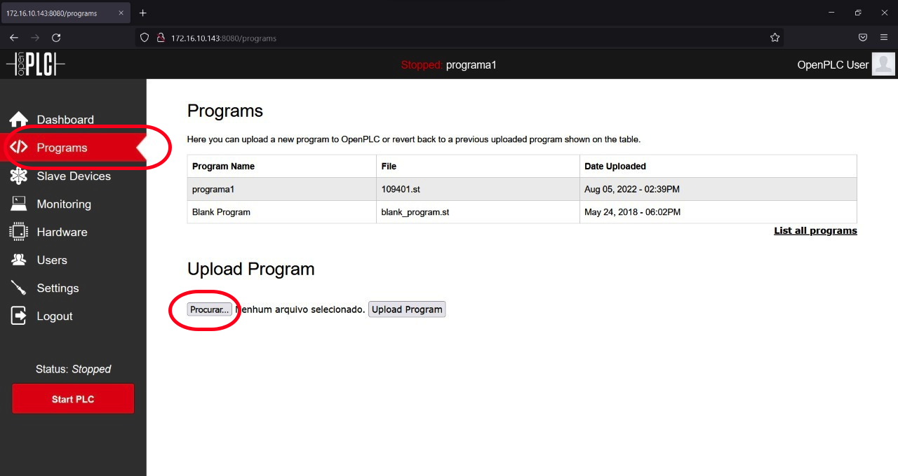

<td style="width: 20%;"></td>

<strong>OpenPLC</strong>

<strong>Prof Epaminondas Lage</strong>

<a href="http://lattes.cnpq.br/7787341723868111"> Currículo Lattes LAGE, E. S.</a> 

# Índice 

* [Carregando programas para o OpenPLC Runtime](#Carregando-Programas-para-o-OpenPLC-Runtime)
* [Referências](#Referências)

# Carregando programas para o OpenPLC Runtime 
 
A runtime do OpenPLC possui um servidor web integrado que permite configurar o OpenPLC e também fazer upload de novos programas para que ele seja executado. Microimplementações do OpenPLC Runtime (ou seja, versões do runtime que vão em microcontroladores e placas Arduino) não possuem o servidor web embutido. Em vez disso, todas as configurações de runtime para o micro runtime são feitas diretamente da caixa de diálogo de upload do OpenPLC Editor (veja Instalando o OpenPLC Runtime em Placas Microcontroladoras).

O servidor Web OpenPLC pode ser acessado abrindo um navegador da Web em seu computador e digitando o endereço IP do seu dispositivo OpenPLC na porta 8080.

Após efetuar login no servidor web, você verá o painel do OpenPLC com algumas informações sobre o programa em execução atual e os logs de tempo de execução.

  http://ip_do_orangePi:8080
  User:openplc
  Paswwd:openplc
  
Para carregar seu novo programa, vá para a seção Programas no menu à esquerda. Lá você deve ver uma lista de todos os seus programas enviados recentemente. Você pode reverter para um programa carregado anteriormente apenas clicando nele na lista e confirmando na próxima página. Para fazer o upload de um novo programa, clique em “Choose File”, selecione seu arquivo .st e clique em “Upload Program”.

<table border="0">
<tbody>
<tr>
<td style="width: 50%;"></td>
</tr>
<tr>
<td style="text-align: center;">Figura 01 - Fazer carga de programa no OpenPLC Runtime.</td>
</tr>
</tbody>
</table>

<table border="0">
<tbody>
<tr>
<td style="width: 50%;"></td>
</tr>
<tr>
<td style="text-align: center;">Figura 02 - Fazer carga de programa no OpenPLC Runtime.</td>
</tr>
</tbody>
</table>

Na janela que aparece, basta preencher algumas informações sobre o seu programa para que você saiba do que se trata na próxima vez que tentar carregá-lo novamente. Quando terminar, clique em “Upload program” para finalmente carregar seu novo arquivo .st no OpenPLC.

<table border="0">
<tbody>
<tr>
<td style="width: 50%;"></td>
</tr>
<tr>
<td style="text-align: center;">Figura 03 - Escolha do programa a ser carregado na Runtime do OpenPLC.</td>
</tr>
</tbody>
</table>

Assim que o arquivo for carregado, você será direcionado de volta à tela do painel e o status do OpenPLC mudará para “compilando”. Os logs sobre o processo de compilação são exibidos na caixa de logs de tempo de execução. Quando o processo de compilação estiver concluído, o status mudará para “executando” e seu novo programa será executado. Se houver um erro em seu programa, o status mudará para “parado” e os erros serão exibidos na caixa de logs de tempo de execução.

<table border="0">
<tbody>
<tr>
<td style="width: 50%;"></td>
</tr>
<tr>
<td style="text-align: center;">Figura 04 - Compilação do programa .sd para ser executado no hardware selecionado.</td>
</tr>
</tbody>
</table>

# Referências

* https://openplcproject.com/docs/2-2-uploading-programs-to-openplc-runtime/
