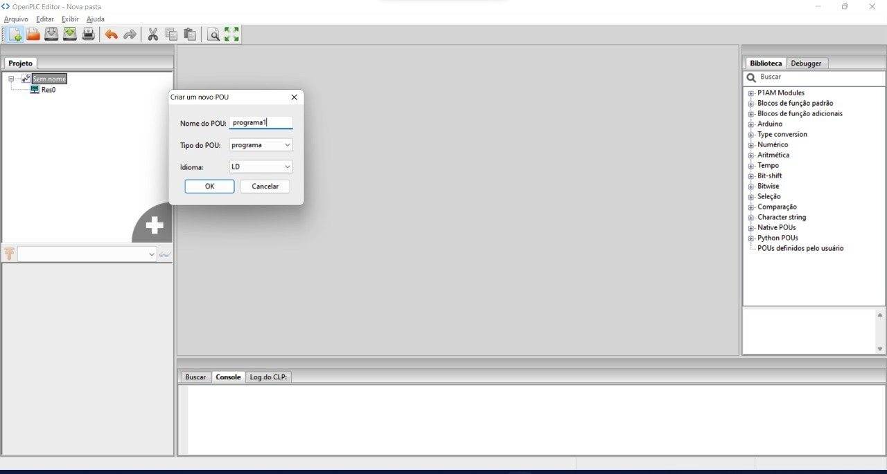

# Criando o primeiro projeto no OpenPLC Editor

Este primeiro projeto é um simples de  botão liga e botão desliga que aciona uma saída de relé. Você vai precisar de:

    * Um microcontrolador com o OpenPLC Runtime instalado, no nosso caso o OrangePi One.
    * Um microcomputador com o OpenPLC Editor instalado e acesso a rede local.
    * Dois botões de pressão
    * Um Rele
    * Um Protoboard
    * Uma conexão de rede ethernet com conector RJ45 no microcontrolador
    * Jumpers 
    
Para começar, conecte seu circuito assim:

<table border="0">
<tbody>
<tr>
<td style="width: 50%;"></td>
</tr>
<tr>
<td style="text-align: center;">Figura XXX - dsdsdsdsdsdsdjkhsigdigdiuegdiugd.</td>
</tr>
</tbody>
</table>

Para a montagem deste circuito no Kit SBC Linux faça a montagem da figura XXXX.

<table border="0">
<tbody>
<tr>
<td style="width: 50%;"></td>
</tr>
<tr>
<td style="text-align: center;">Figura XXXX - Montagem do  primeiro circuito no Kit SBC Linux.</td>
</tr>
</tbody>
</table>

Observações Importantes:

* Vcc é o nível de tensão positivo para o seu dispositivo. Por exemplo, para OrangePi one é +3,3V.
* B00 e B01 são botões de pressão R1 e R2 são resistores pull-down já disponíveis no módulo de Botões.
* Nas placas Raspberry Pi, as duas primeiras entradas (%IX0.0 e %IX0.1) são invertidas no hardware. Isso pode causar problemas, pois será como se os botões fossem pressionados constantemente. Você pode inverter a entrada em seu programa PLC usando contatos negados (se você souber como fazê-lo) ou você pode simplesmente usar outras entradas, como %IX0.2 e %IX0.3.

Comece criando um novo projeto no Editor OpenPLC. Para isso basta clicar em Arquivo -> Novo. A caixa de diálogo  aparecerá para permitir que você escolha onde deseja armazenar seu projeto. Os projetos do Editor OpenPLC são na verdade pastas em vez de um único arquivo. Você não pode armazenar um projeto em uma pasta que já contenha arquivos. Crie uma nova pasta para o seu projeto, abra-a e escolha-a como local do seu projeto.

Depois de selecionar sua localização, o OpenPLC Editor criará o projeto para você com as configurações e configurações padrão e abrirá uma nova caixa de diálogo solicitando que você crie uma nova POU. POU significa Unidade de Organização do Programa e é usado para armazenar todo o código que você escreve em seu projeto. Existem três tipos de POUs que você pode criar:

    Programa – código de aplicação que combina entradas, saídas, funções e blocos de função
    Função – código de usuário reutilizável que tem um valor de retorno.
    Bloco de Função – código de usuário reutilizável que pode reter seu estado (instância)

<table border="0">
<tbody>
<tr>
<td style="width: 50%;"></td>
</tr>
<tr>
<td style="text-align: center;">Figura XXX - dsdsdsdsdsdsdjkhsigdigdiuegdiugd.</td>
</tr>
</tbody>
</table>

Para o propósito deste tutorial, estamos criando apenas uma POU de Programa. Portanto, basta preencher o nome do seu programa, certifique-se de que o Tipo de POU seja “programa” e que o Idioma seja “LD”. Além disso, lembre-se de que o nome do programa não pode conter espaços ou caracteres especiais.

<table border="0">
<tbody>
<tr>
<td style="width: 50%;"></td>
</tr>
<tr>
<td style="text-align: center;">Figura XXX - dsdsdsdsdsdsdjkhsigdigdiuegdiugd.</td>
</tr>
</tbody>
</table>
  
Quando você cria um novo programa, o OpenPLC Editor cria automaticamente uma configuração, um recurso, uma tarefa e uma instância para você. Esses itens dizem ao OpenPLC o que fazer com seu programa (ou seja, quando chamar uma função, como operar ciclicamente, etc). Você pode editar esses itens clicando duas vezes em Res0 no painel esquerdo.
  
<table border="0">
<tbody>
<tr>
<td style="width: 50%;"></td>
</tr>
<tr>
<td style="text-align: center;">Figura XXX - dsdsdsdsdsdsdjkhsigdigdiuegdiugd.</td>
</tr>
</tbody>
</table>
  
A janela principal exibirá um campo de entrada de variável global na parte superior (que permite criar variáveis globais para seu programa), uma janela de Tarefas e uma janela de Instâncias. Você pode criar novas tarefas clicando no sinal de mais verde dentro da janela Tarefas. Não estamos criando novas tarefas para este projeto. No entanto, você pode querer alterar o Intervalo para sua tarefa dependendo do hardware no qual você está executando o OpenPLC.

Os programas do CLP são cíclicos, o que significa que eles iniciam na primeira instrução, terminam na última instrução, esperam um pouco e depois fazem tudo de novo da primeira à última instrução. O intervalo de tarefas significa com que frequência seu ciclo de programa será chamado. O padrão é 20ms, o que significa que seu programa será executado uma vez a cada 20ms. Se você precisar que seu programa seja executado com mais frequência, poderá ajustar o tempo conforme desejar. No entanto, lembre-se de que, se você escolher um tempo cíclico muito baixo (como 1 ms), seu programa pode consumir 100% da CPU do seu dispositivo e ainda assim o dispositivo pode não conseguir executar seu programa corretamente. Um número seguro para todas as plataformas é geralmente 20ms.

Plataformas que possuem um sistema operacional como Windows e Linux são menos responsivos e podem não se comportar bem com tempos de ciclo mais baixos. Isso porque o Sistema Operacional pode interferir no escalonamento do ciclo do PLC dependendo das prioridades do kernel do SO. Plataformas simples como as placas Arduino, por outro lado, são realmente boas para manter um tempo de ciclo preciso e são mais suscetíveis a tempos de ciclo mais baixos.
  
<table border="0">
<tbody>
<tr>
<td style="width: 50%;"></td>
</tr>
<tr>
<td style="text-align: center;">Figura XXX - dsdsdsdsdsdsdjkhsigdigdiuegdiugd.</td>
</tr>
</tbody>
</table>
  
Agora que seu projeto foi finalmente criado, você pode começar a desenhar o diagrama lógico ladder. Clique no nome do seu programa no painel esquerdo para abrir o editor de lógica ladder. A parte superior da tela é reservada para suas variáveis. A parte central é usada para o seu diagrama. Então, vamos começar adicionando algumas variáveis. Clique no sinal de mais verde e adicione três variáveis:

<table border="0">
<tbody>
<tr>
<td style="width: 50%;"></td>
</tr>
<tr>
<td style="text-align: center;">Figura XXX - dsdsdsdsdsdsdjkhsigdigdiuegdiugd.</td>
</tr>
</tbody>
</table>

  O que queremos alcançar com este programa é que sempre que B00 for pressionado, a saída 00 será acionada e permanecerá até que B01 seja pressionado. Isso é alcançado por um circuito simples de trava de lógica ladder como este:
  
<table border="0">
<tbody>
<tr>
<td style="width: 50%;"></td>
</tr>
<tr>
<td style="text-align: center;">Figura XXX - dsdsdsdsdsdsdjkhsigdigdiuegdiugd.</td>
</tr>
</tbody>
</table>
  
  Para criar este circuito no editor, comece adicionando um barramento de alimentação esquerdo clicando no ícone do barramento de alimentação na barra de ferramentas.
  
<table border="0">
<tbody>
<tr>
<td style="width: 50%;"></td>
</tr>
<tr>
<td style="text-align: center;">Figura XXX - dsdsdsdsdsdsdjkhsigdigdiuegdiugd.</td>
</tr>
</tbody>
</table>
  
Ajuste a contagem de pinos do trilho de alimentação esquerdo. Adicione outro barramento de alimentação, mas desta vez selecione “trilho de alimentação direito” nas propriedades. Coloque-o no lado direito da tela. Isso é suficiente para você configurar os degraus do seu Diagrama Ladder.

Agora você pode começar a adicionar seus elementos de escada. Adicione um contato clicando no botão de contato na barra de ferramentas ou clicando com o botão direito do mouse na janela do editor em branco e selecionando Adicionar->Contato. Na janela que aparece, no parâmetro “Variável”, selecione B0 para associar seu novo contato à variável B00.
Repita o processo para adicionar mais dois contatos, um associado ao B01 e outro associado ao Q0. Para o contato Q0, selecione Negado como modificador. Finalmente, adicione uma bobina clicando no botão bobina na barra de ferramentas ou clicando com o botão direito do mouse na janela do editor em branco e selecionando Adicionar-> bobina. Associe sua nova bobina à variável Q0 e adicione um barramento de alimentação direito para fechar o circuito. Posicione os componentes no lugar para que eles se pareçam com esta imagem:  

<table border="0">
<tbody>
<tr>
<td style="width: 50%;"></td>
</tr>
<tr>
<td style="text-align: center;">Figura XXX - dsdsdsdsdsdsdjkhsigdigdiuegdiugd.</td>
</tr>
</tbody>
</table>
  
O passo final é conectar todos os componentes arrastando suas extremidades para formar uma linha. Conecte o lado esquerdo dos contatos B0 e Q0 ao barramento de alimentação esquerdo. Conecte o lado direito do B00 com o B01, o lado direito do B01 com a bobina Q0 e o lado direito da bobina Q0 com o barramento de alimentação direito. Desenhe o circuito de contato Q0 paralelo conectando o lado direito do contato Q0 com o lado esquerdo do B01. Seu projeto final deve se parecer com a figura 10 neste tutorial.

Este circuito inicialmente tem a Q0 desligada. Quando você pressiona B00 mesmo que por um pequeno instante, o circuito aciona a Q0 (dado que B01 também não é pressionado). Uma vez que a Q0 liga, ela ignora o botão B01 no circuito para se ligar continuamente mesmo após liberar B00. Este é um bom truque na lógica ladder, você pode realmente usar as saídas como contatos! Agora, a única maneira de desligar a Q0 é pressionando B01. Como o B01 é um contato negado, ele abrirá o circuito assim que for pressionado, desligando a Q0.

Agora que seu projeto foi criado, é um bom momento para testá-lo antes de carregá-lo no OpenPLC Runtime. Você pode simular o comportamento do seu programa clicando em Start PLC Simulation na barra de ferramentas.

<table border="0">
<tbody>
<tr>
<td style="width: 50%;"></td>
</tr>
<tr>
<td style="text-align: center;">Figura XXX - dsdsdsdsdsdsdjkhsigdigdiuegdiugd.</td>
</tr>
</tbody>
</table>

Quando você clica nesse botão, seu projeto é compilado usando um processo semelhante ao OpenPLC Runtime. Se houver algum erro em seu programa, a compilação falhará e você será alertado sobre os erros no painel Console na parte inferior da tela. Se a compilação for bem-sucedida, o OpenPLC Editor começará a executar seu código. Para visualizar seu código rodando interativamente, clique em Debug instance no painel esquerdo:

<table border="0">
<tbody>
<tr>
<td style="width: 50%;"></td>
</tr>
<tr>
<td style="text-align: center;">Figura XXX - linhas verdes e pretas.</td>
</tr>
</tbody>
</table>

Isso abrirá uma nova janela onde você poderá ver o fluxo elétrico do seu programa. As linhas em verde são ativadas, onde as linhas em preto não são. Você pode forçar um contato ou bobina a ser ativado ou desativado clicando com o botão direito nele e selecionando Forçar Verdadeiro ou Forçar Falso. Tente forçar B01 a ser verdadeiro e observe o caminho do fluxo para a bobina Q0. Em seguida, force B01 de volta para falso e verifique se Q0 ainda está ativado devido ao circuito de trava.

Além de visualizar graficamente o fluxo elétrico no diagrama, você também pode acompanhar os dados em cada variável do seu programa no painel Debugger no lado direito da tela. Você pode adicionar variáveis no painel Debugger clicando no ícone de óculos na frente de cada variável do painel à esquerda. Além disso, clicando duas vezes em uma variável no painel Debugger, você pode ver um gráfico em tempo real mostrando os valores atuais da variável. Isso pode ser muito útil quando seu programa está contando etapas ou manipulando dados.

<table border="0">
<tbody>
<tr>
<td style="width: 50%;"></td>
</tr>
<tr>
<td style="text-align: center;">Figura XXX - Simulação do programa em execução.</td>
</tr>
</tbody>
</table>
  
Finalmente, depois de ter criado e testado o programa, o último passo é gerar seu programa em um formato que o OpenPLC Runtime entenda. Para isso, basta clicar em Generate program for OpenPLC Runtime na barra de ferramentas e salvar o arquivo .st em seu computador. Este arquivo é seu programa de lógica ladder escrito em uma linguagem que o OpenPLC Runtime pode entender. Você pode carregar este arquivo posteriormente para o OpenPLC Runtime conforme explicado em no tutorial Carregando Programas para o OpenPLC Runtime. 
